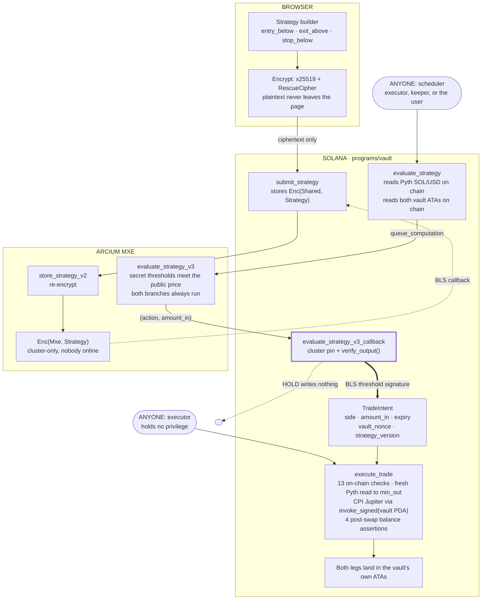
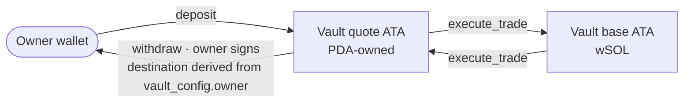

# ARCHITECTURE

What SilentEdge is, verified against `programs/vault/src/`,
`encrypted-ixs/src/lib.rs`, `apps/` and `packages/`.

**Status: running on devnet. Not audited. Not on mainnet.** Program id
`J7mfFVqo7L8jKHiVREeBti6cVrDLyHGQcUT3tHrgfNEJ`. The upgrade authority is a
**single hot key** today — T-3, graded **UNVERIFIED** in
[`SECURITY.md`](SECURITY.md). Every custody statement below is about
the *deployed* code and is conditional on that key.

---

## 1. The whole system



**C3 is the trust boundary.** The cluster pin and `verify_output()` are what
stand between an MPC result and a writable `TradeIntent`; everything downstream
of it is enforced by the program, not asserted by the cluster.

---

## 2. Why each piece

| Piece | Why |
|---|---|
| **Solana** | Enforcement must live where it cannot be quietly changed: limits, allowlists, intent lifecycle and the swap CPI are all in the program. The backend holds no key that can move funds; its worst case is refusing to schedule work — liveness, never safety. |
| **Arcium** | Strategy parameters evaluated under MPC, secret-shared across Arx nodes. Cerberus is dishonest-majority: they stay confidential as long as **one node is honest**, even if every other node colludes. |
| **The BLS callback** | The authorization channel. The brief wanted `MXESigningKey` to sign Solana transactions; it cannot — `ArcisEd25519` is SHA3-512, not RFC-8032 (research F1). The callback is better anyway: MPC produces a *claim*, the program enforces every rule about it, and compromising the MPC layer entirely still yields no withdrawal path. |
| **Pyth** | Trigger and on-chain floor. A DEX spot price as trigger would let an attacker push a pool to fire someone's stop and take the other side. `evaluate_strategy` takes no price argument — it reads the feed on chain. |
| **Jupiter Router `/build`** | Funds sit in a PDA-owned ATA, so the swap must be a CPI under `invoke_signed`; the Meta-Aggregator path returns a transaction we cannot compose into. CPI forfeits lookup tables, so `onlyDirectRoutes` bounds the account list. |
| **MagicBlock — not used** | Delegated accounts are locked on L1, and both mandatory L1 writes (the callback writing `TradeIntent`, and `execute_trade`) target exactly the accounts we would delegate. Delegation and Arcium-attested authorization are mutually exclusive over the same accounts. [`docs/magicblock-evaluation.md`](docs/magicblock-evaluation.md) |

Sourced findings behind these choices: [`docs/research.md`](docs/research.md).

---

## 3. Money flow



> Funds leave a vault by exactly two paths: a swap between the two allowlisted
> mints where both sides stay inside the same vault, or a withdrawal to
> `VaultConfig.owner` signed by the owner. There is no third path, and **no
> instruction in the deployed program accepts an operator authority** — subject
> to T-3, since the upgrade authority can replace the deployed code.

`withdraw`'s destination is derived from `vault_config.owner`, never a parameter;
it ignores `status` and touches no Arcium account, so it works even if the MPC
network, the backend and the executor are all down. `pause`/`resume`/`stop` are
owner-only: a `GUARDIAN` constant used to exist and resolved to the program's own
id — the deploy keypair's public key — handing the deployer power to pause any
user's vault. Removed, not repointed.

---

## 4. Strategy flow

| # | Step | Where | Who signs | Result |
|---|---|---|---|---|
| 1 | author | `apps/web` | — | `entry_below`, `exit_above`, `stop_below`. `size_bps` is public. |
| 2 | encrypt | `packages/sdk/src/encrypt.ts` | — | x25519 ECDH to the MXE key, RescueCipher, fresh nonce. **Plaintext never leaves the page.** |
| 3 | submit | `submit_strategy(...)` | owner | `Enc(Shared, Strategy)` on chain |
| 4 | convert | `convert_strategy(offset)` | owner | → `store_strategy_v2`, callback writes `Enc(Mxe, Strategy)` |
| 5 | evaluate | `evaluate_strategy(offset)` | **anyone** | → `evaluate_strategy_v3`, callback writes a `TradeIntent` — or nothing, on HOLD |

**Why two steps.** `Enc<Shared, _>` is readable by the submitter. `Enc<Mxe, _>`
is readable only by the cluster acting together, which is what lets evaluation
run with **nobody online** — not the operator, not the owner's browser.
Replacing a strategy zeroes the converted copy and `mxe_version`, so the old one
stops being evaluable at once and trading halts until the owner converts the
replacement. Fail closed. `copy_strategy` follows a *listed* vault by copying
`Enc<Mxe, Strategy>` bytes — safe because that ciphertext is encrypted to the
cluster, not to a person, and the follower keeps their own limits and `size_bps`.

```rust
pub fn evaluate_strategy_v3(
    strategy_ctxt: Enc<Mxe, Strategy>,  // secret: entry_below, exit_above, stop_below
    price: u64,                         // public — Pyth, read on chain
    quote_value: u64, base_value: u64,  // public — the vault's own ATAs
    size_bps: u64,                      // public — VaultConfig
) -> (u8, u64)                          // (action, amount_in) — revealed
```

- **Only the action escapes** — nothing about which threshold was crossed or how
  far past it the price is.
- **No data-dependent control flow.** Arcis executes both branches of every
  conditional regardless, so timing cannot leak which condition fired. A rule
  switched off is a sentinel that can never match (`0` buy, `u64::MAX` sell), so
  "off" is indistinguishable from "on".
- **A stop exits the whole position**; anything else trades `size_bps` of the
  balance actually being debited. Selling wins over buying: a price below the
  stop is also below the entry.
- **Liveness.** Cerberus is detect-and-abort — any single node can abort, so
  liveness is not assured. HOLD and "aborted" look identical from outside and
  both are normal. No intent means no trade; nothing infers a default action from
  a missing result.

---

## 5. Enforcement points on chain

`execute_trade` is callable by **anyone**, safely: every parameter is fixed in
`TradeIntent`, and every rule is checked against on-chain state rather than
anything the caller supplies. The executor chooses only whether and when, inside
the window — liveness, not trust. Users can self-execute from the web app.

| # | Check | Error |
|---|---|---|
| 1 | vault `status == Active` | `VaultNotActive` |
| 2 | `!consumed`, `amount_in > 0` | `IntentAlreadyConsumed` / `NoTradeAuthorized` |
| 3 | `intent.vault_nonce == vault.nonce` | `IntentStale` |
| 4 | `intent.strategy_version == strategy.mxe_version` | `IntentStrategyMismatch` |
| 5 | `slot <= expires_at_slot` (TTL 180 slots, ~72 s) | `IntentExpired` |
| 6 | source ATA holds `amount_in` | `InsufficientSourceBalance` |
| 7 | `amount_in >= min_trade_bps` of source balance, if set | `TradeTooSmall` |
| 8 | *entries only:* `amount_in <= max_trade_bps` of source balance | `TradeTooLarge` |
| 9 | *entries only:* cooldown elapsed | `CooldownActive` |
| 10 | fresh Pyth: ≤30 s old, conf ≤100 bps, price within \$1–\$10,000 | `ConfidenceTooWide`, … |
| 11 | `min_out` derived on chain from that price + the vault's slippage limit, `> 0` | `TradeTooSmall` |
| 12 | *entries only:* exposure ceiling `max_base_exposure_bps`, if set | `ExposureLimitReached` |
| 13 | swap program is the pinned Jupiter id (address constraint) | `SwapProgramNotAllowed` |

Then the CPI, then — after reloading both ATAs — exactly `amount_in` left the
source (`UnexpectedSourceDelta`), the destination did not fall
(`DestinationDrained`), it gained at least `min_out` (`SlippageExceeded`), and
the vault's lamports are unchanged (`VaultLamportsChanged`).

**Exits skip 8 and 9 on purpose.** `max_trade_bps` can never exceed 50% and a
stop exits the whole position, so applying the cap to sells rejected *every*
stop-loss. Same for the cooldown: `execute_trade` is permissionless, so gating
sells would let anyone burn the window on a benign trade and lock out a
de-risking exit. A sell is already bounded by `min_out`.

**`min_out` is derived on chain** because a caller-supplied floor is the whole
vulnerability: an executor naming its own could route the vault's funds through a
pool it controls, fill at a ruinous price, keep the difference, and the swap
still "succeeds". The floor takes the end of the Pyth confidence interval that
yields the *larger* value, so oracle uncertainty cannot be spent as slippage.

**State backing these checks.** Three PDAs — `VaultConfig` (`["vault", owner]`),
`StrategyState` (`["strategy", vault]`, both ciphertext sets and their versions),
and `TradeIntent` (`["intent", vault]`), a **singleton per vault** so a new
decision overwrites any unconsumed one. Token accounts are ATAs derived from
`vault_config`, never stored as fields, so they cannot be pointed elsewhere.
`is_armed()` requires **both** a non-zero `mxe_version` and non-zero ciphertext —
`convert_strategy` claims the version at queue time, before the ciphertext
exists, so the version alone would let an evaluation run against 96 zero bytes.

**Three gaps, stated rather than buried.**

- **`daily_loss_limit_bps` is stored and not enforced.** Nothing reads it.
  Realised P&L needs a cost basis, and tokens enter and leave outside trading, so
  assigning basis would put the oracle on the `withdraw` path — which must keep
  working when Pyth, Arcium and the operator are all unavailable. It stays
  because removing it changes the account layout. Do not describe it as
  protection.
- There is **no realised-price deviation band** after the swap. `min_out`,
  checked against the actual balance delta, is the whole slippage bound.
- `max_oracle_deviation_bps` *is* read by `execute_trade` — an entry filling more
  than that band above the price the decision was made at is refused — but the
  check is guarded on `intent.oracle_price > 0`, and
  `evaluate_strategy_v3_callback` writes `0` there. On the live callback path the
  band does not engage; the tests that exercise it seed an intent directly on a
  mainnet fork. Do not count it as a control until the callback records the
  decision price.

---

## 6. The trust boundary: cluster pinning

Arcium's generated constraint derives the cluster account from the MXE account,
so it silently follows a `migrate-cluster`, and `verify_output()` validates the
BLS signature against **whatever cluster account is passed**. Left as generated,
an operator who migrated the MXE to a cluster they control could mint
attestations this program accepts as genuine MPC results — forging trade
authorizations. Both callbacks therefore assert first:

```rust
require!(ctx.accounts.cluster_account.key() == expected_cluster(),
         VaultError::UnexpectedCluster);
```

`expected_cluster()` derives the PDA from `EXPECTED_CLUSTER_OFFSET` — `456` on
devnet, `2026` under `--features mainnet` — so changing it needs a program
upgrade. This closes the forgery path, turns a migration into a loud halt rather
than a silent continuation, and leaves `withdraw` untouched. It does **not**
protect ciphertext already on chain (§8.4). And `SECURITY.md` grades the
pin **CODED, not ENFORCED**: the derivation is unit-tested, the call site is not,
so no test fails if the `require!` is deleted.

---

## 7. Public, private, and neither

| | |
|---|---|
| **Public, unavoidable** | vault existence, owner, balances, limits; every trade's side, amount in, amount out, timestamp, route; that an evaluation occurred and the price it used; `TradeIntent` in the window between callback and execution; strategy *ciphertext*; queue/finalization events and fees |
| **Private under 1-of-n honest** | `entry_below`, `exit_above`, `stop_below`; which condition triggered an action; the strategy of a vault that has never traded |
| **Cannot be private** | that the user runs a bot at all; any executed trade, on any public chain; thresholds, given enough trades |

**`size_bps` is public, and encrypting it protected nothing.** The traded amount
and the vault balance are both public in the same transaction, so
`size_bps = amount × 10_000 / balance` recovers it exactly from one trade. It was
the fourth field of the encrypted struct; it is now a `VaultConfig` setting (T-38).

**Thresholds leak statistically.** An observer who records the price at every
evaluation and sees which ones produced a BUY can bound `entry_below` from both
sides, and enough observations narrow it arbitrarily. Inherent to acting on
chain, not an Arcium weakness. SECURITY.md T-9 lists candidate mitigations
(jittered cadence, randomised size, threshold bands); **none are implemented.**

---

## 8. Assumptions and authorities

If any of these fails, strategy confidentiality fails.

1. **At least one Arx node is honest.** n−1 colluding nodes learn nothing; all n
   colluding exposes strategies.
2. **Liveness is not assured.** Detect-and-abort; trading fails closed.
3. **BLS aggregate integrity.** The program trusts `verify_output()`, never the
   callback transaction's Solana signer — an ordinary node keypair carrying no
   security property.
4. **The MXE authority is trusted for *historical* confidentiality, and this
   cannot be fixed today.** It can `migrate-cluster` to a cluster it controls
   (fully internal clusters are a documented, supported feature), reconstruct MXE
   key material, and decrypt strategy ciphertexts already published on chain.
   There is no CLI command to transfer, burn or timelock the MXE authority, and
   Recovery Peers have no documented veto — they hold encrypted shares of the key
   and cannot refuse a migration. Cluster pinning halts the system and blocks
   forgery; it cannot un-publish ciphertext.
5. **The program upgrade authority is trusted.**

| Authority | Today (devnet) | Before mainnet |
|---|---|---|
| Vault program upgrade | **Single hot key — T-3, UNVERIFIED** | Squads multisig + timelock |
| MXE authority | Deployer keypair | Multisig *if Arcium supports it* — no `set-authority` exists in the CLI surface, so this is unverified |
| Guardian (pause) | **Removed** — the constant was the deploy keypair | Re-add only as a multisig demonstrably not the deployer |

A fresh MXE init requires the program's upgrade authority to sign, and an
immutable program can never initialize a fresh MXE. So: deploy → init MXE →
*then* transfer upgrade authority, and never make the program immutable. A
timelocked multisig makes upgrades public and delayed rather than impossible.

> **The claim, worded honestly.** No instruction in the deployed program accepts
> an operator authority — as long as the deployed code is the code you read,
> which today rests on a single upgrade key (T-3). Strategy parameters stay
> confidential as long as at least one node in the cluster is honest. Executed
> trades are public, and a determined observer can narrow your thresholds by
> watching them. The operator holds the MXE authority; exercising it would halt
> all bots visibly on chain, and would also let the operator decrypt previously
> stored strategies. We disclose this rather than claim protection we do not have.

---

## 9. Latency

| Stage | Expected | Source |
|---|---|---|
| Pyth read + queue tx | ~0.4–1 s | Solana slot time |
| Arcium MPC + callback | **unknown — must benchmark** | not published; 72 s queue TTL, 120 s client default |
| Executor picks up the intent | ~0.4–2 s | our scheduling |
| Jupiter swap confirm | ~0.4–2 s | Solana |

Dominated by an unmeasured MPC term. **Benchmark before making any latency
claim.** This is rule execution, not high-frequency trading, which suits the
strategy class: nobody else is racing to hit *your* private threshold. In a sharp
move the price can travel past the trigger before execution lands, and `min_out`
then makes the trade **fail rather than fill badly** — the bot may simply not
fire during a flash crash, which is correct behaviour, not a defect. Stops are
the weakest fit; treat them as rules that may not execute. Unsuitable for
arbitrage, scalping, or anything where being first matters.

---

## 10. Repository structure

Circuits live inside the Anchor workspace because `arcium build` expects them
there. Every test is a flat `.ts` file in `tests/` — there are no `tests/unit`,
`tests/surfpool` or `tests/e2e` subdirectories.

```
silentedge/
├── programs/vault/src/       lib.rs state.rs oracle.rs constants.rs errors.rs
├── programs/hello_arcium/    smallest end-to-end Arcium program, kept as reference
├── encrypted-ixs/src/lib.rs  Arcis circuits: store_strategy_v2, evaluate_strategy_v3,
│                             export_strategy, add_ten
├── apps/web/                 Next.js — builder, wallet, browser-side encryption,
│                             portfolio, discovery, self-execute
├── apps/api/src/             executor.ts (permissionless keeper loop),
│                             jupiter.ts (/build route, onlyDirectRoutes)
├── packages/sdk/src/         encrypt arcium decide indicators backtest candles
├── packages/types/src/       shared strategy and intent types
├── packages/config/src/      mints, decimals, program id — must match constants.rs
├── tests/                    vault  trade-authorization  trade-authorization-devnet
│                             swap-execution  e2e-devnet  encryption  executor
│                             strategy  strategy-state  indicators  backtest
│                             candles  amount  hello-arcium
├── scripts/                  check-upgrade-authority  register-circuit  seed-fork-intent
├── docs/                     magicblock-evaluation, research, testing, what-is-private,
│                             oracle, visibility, arcium-hello-world
└── Anchor.toml  Arcium.toml  Cargo.toml  package.json  pnpm-workspace.yaml
```

No single environment runs the whole path, and the seam is `TradeIntent`: devnet
has the Arcium MXE but no routable Jupiter liquidity; a surfpool mainnet fork has
the liquidity but no MXE. On the fork the intent is seeded with a cheatcode
rather than produced by a callback — `verify_output()` cannot be mocked, and a
test-only instruction that writes an intent would put a forged-authorization path
in the shipped program. `quote_mint` is USDC on mainnet and a test mint on
devnet, because Circle holds devnet USDC's mint authority and an unfunded vault
leaves the authorization path unexercised.

---

## 11. Scope

**Built, on devnet.** Vault lifecycle (`initialize_vault`, `deposit`, `withdraw`,
`pause`, `resume`, `stop`, `update_limits`, `set_exposure_limits`,
`set_listing`), strategy lifecycle (`submit_strategy`, `convert_strategy`,
`copy_strategy`), confidential evaluation (`init_trade_intent`,
`evaluate_strategy`, both BLS-verified callbacks), `execute_trade` with the
Jupiter CPI. One pair, USDC ↔ SOL, both mints pinned. Cluster pinning on both
callbacks. Permissionless executor plus self-execute in the UI.

**Deliberately not built.** A daily loss limit, a realised-price deviation band
(both §5), MagicBlock, arbitrary user code, multiple pairs, multiple strategies
per vault, mainnet.

**Next, roughly in order.** Move the upgrade authority to a timelocked multisig
(T-3); give the cluster pin a detector so it grades ENFORCED; record the decision
price in the callback so `max_oracle_deviation_bps` engages; benchmark the MPC
term; jittered cadence and randomised sizing against threshold inference (T-9);
a restricted DSL compiling to a fixed-shape circuit, because Arcis circuits must
be fixed-shape.
